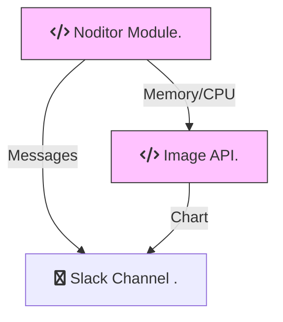

# Architecture

The ***Noditor Module*** pushes error and alert messages directly to a Slack Channel. Memory and CPU stats are pushed through an ***Image API*** before getting forwarded to the Slack Channel as a chart. The ***Image API*** lives on Heroku and is independant of your Node.js Application and the ***Noditor Module***.

