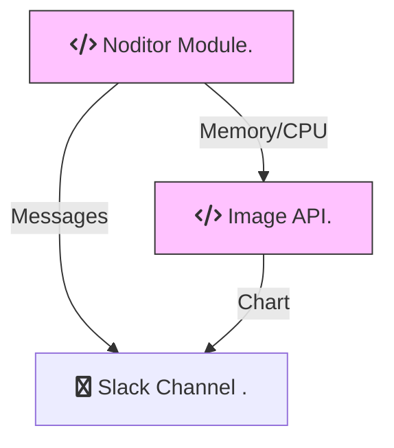

# Overview

***Noditor*** is a light weight monitoring system for Node.js Applications. Anything that uses Node.js can use ***Noditor***, back-end apps, electron, etc. It consists of three parts: *the Noditor Module, an Image API and the Slack Noditor App*. 

- **Noditor Module** (npm install to your Node.js Application)
- **Image API** (lives on Heroku, called by the Noditor Module)
- **Slack Channel** (you create a channel adding the Slack Noditor App, called by the Noditor Module and Image API)

The ***Noditor Module*** is simple by design and places very little overhead on a host Node.js Application. It uses just a tiny amount of memory and CPU usage is nearly undetectable. It retains a small set of data inside a Node.js Application. The size of the data retained can be altered. This makes ***Noditor*** suitable for use in a production environment due to its lightweight footprint.

> Noditor is not a logging system for analytics, unless you want to over-whelm your Slack Channel. Only send important errors and alerts. The Noditor Module has a built in Limiter that will help by eliminating error message duplicates. The Noditor Module will also send stats like Memory and CPU usage if you request.

***Noditor*** as a monitoring system is not a replacement for the major players in the monitoring business but it does not overwhelm a Node.js Application like they do. It provides just enough insight to know if you have an issue and what it might be. From there: you know best.

## Architecture

The ***Noditor Module*** pushes error and alert messages directly to a Slack Channel. Memory and CPU stats are pushed through an ***Image API*** before getting forwarded to the Slack Channel as a chart. The ***Image API*** lives on Heroku and is independant of your Node.js Application and the ***Noditor Module***.

## Version 2x

***Noditor*** is now at version 2x. Version 1x was a different architecture that did not use Slack as its renderer. Version 1x was deprecated some time back and is no longer supported. For version 1x please be sure to use the proper install syntax to prevent the install of version 2x.

## Getting Started

There are two parts to setup before you will get ***Noditor*** running.

- Create a Slack Channel and add the ***Noditor Slack App*** to it.

- Add, configure and start the ***Noditor Module*** inside your Node.js Application.

Start with the [Slack Setup](/slack/main.md?id=Setup) first.

## MIT License

Copyright 2020 Warren Anderson

Permission is hereby granted, free of charge, to any person obtaining a copy of this software and associated documentation files (the "Software"), to deal in the Software without restriction, including without limitation the rights to use, copy, modify, merge, publish, distribute, sublicense, and/or sell copies of the Software, and to permit persons to whom the Software is furnished to do so, subject to the following conditions:

The above copyright notice and this permission notice shall be included in all copies or substantial portions of the Software.

THE SOFTWARE IS PROVIDED "AS IS", WITHOUT WARRANTY OF ANY KIND, EXPRESS OR IMPLIED, INCLUDING BUT NOT LIMITED TO THE WARRANTIES OF MERCHANTABILITY, FITNESS FOR A PARTICULAR PURPOSE AND NONINFRINGEMENT. IN NO EVENT SHALL THE AUTHORS OR COPYRIGHT HOLDERS BE LIABLE FOR ANY CLAIM, DAMAGES OR OTHER LIABILITY, WHETHER IN AN ACTION OF CONTRACT, TORT OR OTHERWISE, ARISING FROM, OUT OF OR IN CONNECTION WITH THE SOFTWARE OR THE USE OR OTHER DEALINGS IN THE SOFTWARE.
